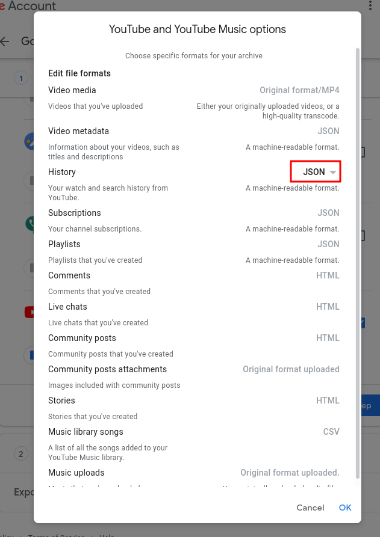

# Usage

## Exporting YouTube history

1. Go to [Google Takeout](https://takeout.google.com/)

2. Under "Create a new export" deselect everything but "YouTube and YouTube Music". Exporting less data will decrease the time spent waiting for Google to export your data.

3. Go to "YouTube and YouTube Music" > "Multiple Formats" and make sure you export history in JSON format instead of HTML

    

4. Instead of all YouTube data you can only export watch history by clicking "All Youtube data included" and only selecting "history"

5. After you have selected the data you want to export click "Next step"

6. Since youtube watch history shouldn't be more than a few megabytes in size you can leave everyting as it is and click "Create export"

7. Now you have to wait for Google to export you data. This can take a while. After they've exported you data you'll receive an email with a download link.

8. Extract downloaded zip and find `watch-history.json`. Copy it somewhere you'll remember, or even better, next to `analyzer.py`.

## Analyzing YouTube history

After you've exported you YouTube watch history you have to decide what information you want to extract from it. You do this by selecting extractors:

```sh
python3 analyzer.py -p /path/to/watch-history.json -e MostWatched MostRecent
```
You can select as many extractors as you want

### Available extractors

#### MostRecent

Prints the most recently watched video

#### MostWatched

Prints the most watched video and how many times you've watched it

#### TotalVideosWatched

Prints the number of videos watched 